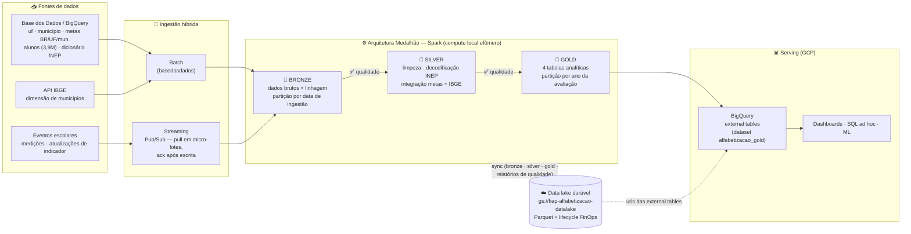

# 📊 Pipeline Híbrido para Análise da Alfabetização no Brasil

**Tech Challenge — Fase 2 (Pós-Tech FIAP · IA para Devs)**

Pipeline de engenharia de dados **batch + streaming** com **Arquitetura Medalhão**
(Bronze → Silver → Gold), implementado em **GCP** (Google Cloud Storage + BigQuery +
Pub/Sub), sobre o dataset público
[`br_inep_avaliacao_alfabetizacao`](https://basedosdados.org/dataset/073a39d4-89cf-4068-b1e8-34ed0d9c0b72?table=e1de7a6a-5038-4e81-89f0-a15f2cc12c9b)
da **Base dos Dados** (INEP), com implementação alternativa em **AWS Glue** incluída no repositório.

---

## 1. Contexto do problema

A alfabetização na infância é um dos pilares do desenvolvimento educacional, social e
econômico de um país. O **Compromisso Nacional Criança Alfabetizada** é a política pública
que mobiliza União, estados, Distrito Federal e municípios com um objetivo mensurável:
**todas as crianças brasileiras alfabetizadas até o final do 2º ano do ensino fundamental,
até 2030**.

Para dar régua e medida a essa política, o INEP realizou em 2023 a **Pesquisa Alfabetiza
Brasil**, que definiu o **ponto de corte de 743 pontos na escala de proficiência do Saeb**:
a partir desse patamar, uma criança é considerada alfabetizada. Nasceu daí o
**Indicador Criança Alfabetizada** — o percentual de estudantes do 2º ano que atingem
essa proficiência.

### O desafio educacional e o papel deste pipeline

Um número nacional não orienta ação local. Para transformar o indicador em política
pública efetiva é preciso responder perguntas como:

- Quais **municípios** estão mais distantes das suas metas — e quanto falta (gap)?
- Como o indicador **evolui no tempo** em cada UF? Quem avança, quem regride?
- A **rede** (municipal, estadual, privada) explica diferenças de desempenho?
- A trajetória observada é compatível com a **meta de 2030**?

Responder isso exige **integrar fontes heterogêneas** — indicador por UF e por município,
metas nacionais/estaduais/municipais, microdados de alunos (~3,9 milhões de registros),
dicionário de códigos do INEP e a malha territorial do IBGE — com qualidade auditável,
escalabilidade e custo de nuvem próximo de zero. É exatamente o que este pipeline entrega:
uma **camada Gold analítica confiável**, pronta para dashboards, análises estatísticas e
modelos de machine learning.

---

## 2. Arquitetura proposta

### Visão geral

**Compute local efêmero + data lake durável na nuvem + serving analítico serverless.**
O processamento Spark roda em modo `local[*]` (fazendo o papel do cluster efêmero — o
mesmo código sobe em Dataproc Serverless sem alteração), o lake vive no **GCS**, a Gold é
servida como **external tables no BigQuery** e o streaming trafega por **Pub/Sub**.

### Diagrama da pipeline



> As três camadas são processadas pelo Spark local (papel do cluster efêmero) e
> **espelhadas no bucket GCS** a cada escrita; o BigQuery lê a Gold **direto do bucket**
> (external tables), sem duplicar armazenamento.

### Fluxo de dados

1. **Ingestão batch** — as 7 tabelas da Base dos Dados são extraídas via BigQuery
   (`basedosdados.read_table`, projeto com billing) e a dimensão de municípios vem da API
   pública do IBGE. Cada entidade é gravada **sem transformação** na **Bronze**, em Parquet
   particionado por data de ingestão (`ano_ingestao/mes_ingestao/dia_ingestao`), com
   metadados de linhagem (`_record_hash` MD5, `_ingestion_timestamp`, `_source_system`).
2. **Ingestão streaming** — um produtor publica eventos JSON (novas medições de alunos,
   atualizações de indicador) no tópico **Pub/Sub** `eventos-alfabetizacao`; o consumidor
   faz *pull* em micro-lotes e grava na Bronze (`eventos_alunos`, `eventos_indicadores`)
   com **ack somente após a escrita** — semântica *at-least-once*, com reentregas
   absorvidas pela deduplicação por `_record_hash` na Silver.
3. **Silver** — limpeza (nulos, duplicatas), padronização de nomes/tipos/acentos,
   **decodificação via dicionário INEP** (ex.: rede `1=federal, 2=estadual, 3=municipal,
   4=privada`), normalização de escalas (proporções 0–100 → 0–1), validação de chaves e
   **integração das bases**: indicador × metas × dimensão IBGE; microdados batch × eventos
   de streaming (`unionByName` + dedup em que o streaming sobrepõe o batch).
4. **Gold** — 4 datasets analíticos, particionados pelo `ano` da avaliação:

   | Tabela | Pergunta que responde |
   |---|---|
   | `gold_alfabetizacao_uf` | Ranking anual das UFs, variação ano a ano (pp) |
   | `gold_alfabetizacao_municipio` | Taxa × meta do ano, gap e atingimento por município |
   | `gold_brasil_evolucao` | Taxa nacional observada × trajetória de metas 2024–2030 |
   | `gold_desempenho_alunos` | Proficiência e % alfabetizados por município/rede/série |

5. **Sincronização e serving** — cada camada é espelhada no bucket GCS preservando o
   layout Hive de partições; a Gold é exposta como **external tables** no dataset BigQuery
   `alfabetizacao_gold` (`CREATE OR REPLACE EXTERNAL TABLE`, com partition pruning via
   `hive_partition_uri_prefix`) para consumo por SQL, Looker Studio e ML.
6. **Qualidade** — cada camada passa por validações (detalhe na seção 5); checks críticos
   reprovados **interrompem o pipeline**; o relatório JSON de cada execução vai para
   `quality_reports/` (local e no bucket). Última execução com dados reais: **33/33 checks
   aprovados** (~3,87M alunos; Bronze ≈ 223 MB; Silver de alunos com 3,36M linhas).

### Estrutura do repositório

```
Tech_Challenge/
├── ETL_Pipeline_GCP.ipynb        # ★ versão cloud oficial (Spark + GCS + BigQuery + Pub/Sub)
├── ETL_Pipeline_PySpark.ipynb    # versão local escalável (base da versão GCP)
├── ETL_Pipeline_Pandas.ipynb     # versão local leve (exploração/validação)
├── etl-bronze.py                 # alternativa AWS: job Glue → s3://…-data-sor/bronze
├── etl-silver.py                 # alternativa AWS: job Glue → s3://…-data-sot/silver
├── etl-gold.py                   # alternativa AWS: job Glue → s3://…-data-spec/gold
├── setup_gcp.ps1                 # provisionamento da infra GCP via gcloud (opcional)
├── lifecycle.json                # regras de ciclo de vida do bucket (FinOps)
└── data_lake/                    # data lake local (espelhado no GCS)
    ├── landing/                  # zona de pouso dos eventos de streaming
    ├── bronze/  ├── silver/  ├── gold/
    └── quality_reports/          # relatórios JSON de qualidade por execução
```

Os notebooks operam em **modo dual**: com as flags ligadas usam os serviços GCP; com todas
desligadas rodam 100% offline sobre um **simulador com o esquema real** das tabelas —
desenvolvimento e regressão com custo zero de nuvem.

| Flag | `True` (nuvem) | `False` (offline) |
|---|---|---|
| `USE_BIGQUERY` | extrai da Base dos Dados via BigQuery | simulador com esquema real |
| `USE_GCS` | espelha as camadas em `gs://` | data lake só em disco |
| `USE_PUBSUB` | streaming via Pub/Sub | landing zone local (JSONL) |
| `USE_BQ_GOLD` | Gold como external tables no BigQuery | Gold só em Parquet |

---

## 3. Tecnologias utilizadas

| Ferramenta | Uso | Justificativa |
|---|---|---|
| **PySpark 3.5** | Engine de transformação | Mesmo código roda no laptop (`local[*]`) e em cluster (Dataproc/EMR/Glue); *predicate pushdown*, *broadcast joins* e escrita particionada fazem diferença na escala real dos microdados (milhões de linhas/ano) |
| **Parquet + Snappy** | Formato de todas as camadas | Colunar: leitura seletiva de colunas e ~5–10× menos bytes que CSV/JSON — menos storage e menos bytes varridos (BigQuery/Athena cobram por bytes lidos) |
| **Google Cloud Storage** | Data lake durável | Objeto barato e escalável; bucket regional `us-east1` dentro do *always-free tier* (5 GB-mês); lifecycle nativo para FinOps |
| **BigQuery** | Fonte (Base dos Dados) e serving da Gold | A fonte primária **já vive no BigQuery** — extração direta sem egress intermediário; external tables servem a Gold com custo de storage zero e SQL serverless |
| **Pub/Sub** | Mensageria do streaming | Serverless, sem broker para administrar; free tier de 10 GB/mês cobre a carga; semântica *at-least-once* compatível com a deduplicação da Silver |
| **basedosdados (lib)** | Extração das tabelas do INEP | Cliente oficial da plataforma, resolve autenticação e billing project |
| **API de localidades do IBGE** | Dimensão de municípios | Fonte pública oficial dos 5.570 municípios (código de 7 dígitos, nome, UF, região), gratuita, com cache local |
| **pandas / PyArrow** | Interfaces de extração e relatórios | `basedosdados` e a API IBGE retornam DataFrames; Arrow acelera a conversão pandas↔Spark |
| **AWS Glue + S3** (alternativa) | Jobs `etl-*.py` | Demonstra a portabilidade do desenho medalhão para AWS (buckets SOR/SOT/SPEC), com os mesmos checks de qualidade abortando jobs |

---

## 4. Decisões arquiteturais (trade-offs)

| Decisão | Alternativa | Por quê |
|---|---|---|
| **Batch para históricos + streaming só para eventos novos** | Tudo streaming | Metas e séries históricas mudam raramente (aferições anuais); streaming contínuo custa caro e não agrega frescor útil. Eventos novos (medições, atualizações de indicador) chegam por Pub/Sub |
| **Data lake (Parquet no GCS) + warehouse como camada de consumo** | Data warehouse direto | O lake preserva o dado bruto barato, flexível e reprocessável (Bronze imutável); o BigQuery entra apenas onde agrega valor — SQL serverless sobre a Gold — via external tables, sem duplicar armazenamento |
| **Custo ⇄ performance: compute local efêmero** | Cluster gerenciado sempre ligado | No volume atual (~4M linhas), o Spark local processa em minutos com custo zero; a arquitetura já está pronta para subir em Dataproc Serverless quando o volume justificar — paga-se só o tempo de execução |
| **Sync pós-escrita para o GCS** | gcs-connector do Hadoop (`gs://` direto no Spark) | O conector via Ivy em Windows (winutils + caminhos com espaços/OneDrive) é frágil e o commit por rename é lento no GCS; o sync preserva o modo offline intacto. Em Dataproc o conector é nativo — evolução natural |
| **External tables na Gold** | Load nativo no BigQuery | Zero storage duplicado e refresh automático a cada overwrite da Gold; load nativo só compensaria com SLA agressivo de latência de consulta |
| **Pub/Sub pull em micro-lotes** | Spark Structured Streaming / Dataflow | Mesma semântica *at-least-once* (ack pós-escrita + dedup por `_record_hash`) com custo zero e execução didática; `readStream`/Dataflow entram quando houver volume e exigência de latência reais |
| **GCP como nuvem principal** | AWS (jobs Glue deste repositório) | A fonte já está no BigQuery (sem custo de egress na extração) e os free tiers cobrem 100% da carga; no Glue, cada job custa por DPU-hora (~US$ 0,44/DPU-h) mesmo para cargas pequenas. Os `etl-*.py` mantêm a opção AWS pronta |
| **Partições de ingestão separadas do ano do dado** | Particionar tudo por data de processamento | Bronze/Silver particionam por `ano/mes/dia_ingestao` (auditoria e reprocesso); a Gold particiona pelo `ano` da avaliação — é assim que os consumidores filtram, habilitando partition pruning |

---

## 5. Governança e qualidade de dados

Validações executadas **em todas as camadas**, com nível de criticidade — check crítico
reprovado **interrompe o pipeline** (nos jobs Glue, `raise` aborta o job):

- **Duplicidade**: unicidade de chaves simples e compostas (ex.: `ano+sigla_uf+rede+serie`;
  `ano+id_aluno` após dedup batch×streaming);
- **Valores ausentes**: `not_null` nas chaves e métricas; descarte justificado e logado
  (ex.: alunos ausentes na prova ou sem proficiência);
- **Chaves de relacionamento**: `id_municipio` com regex `^\d{7}$` (código IBGE), siglas de
  UF no domínio das 27 unidades; joins com `assert` de não-explosão de linhas;
- **Consistência entre tabelas**: decodificação conferida contra o dicionário INEP;
  proporções por nível somando ~1; taxas no intervalo [0, 100]; proficiência em [300, 1100];
- **Volumetria**: `row_count_min` por entidade (detecta extração truncada).

Cada execução gera um **relatório JSON** (`quality_reports/quality_report_<timestamp>.json`)
com o resultado de todos os checks e o score global — versionado no data lake e espelhado
no GCS como trilha de auditoria.

---

## 6. Monitoramento e FinOps

### Como o pipeline é monitorado

- **Qualidade como gate**: os checks críticos funcionam como *circuit breaker* — dado ruim
  não avança de camada; o score por execução fica registrado em `quality_reports/`;
- **Volumetria por camada**: cada escrita loga contagem de linhas e arquivos sincronizados
  (`[gcs] bronze/uf +N arquivo(s)`), permitindo detectar variações anômalas entre execuções;
- **Streaming observável**: o consumidor Pub/Sub loga lotes puxados/processados; fila
  parada é visível pelo *backlog* da subscription no console GCP;
- **Jobs Glue (alternativa AWS)**: logging estruturado (`[DQ:CAMADA] PASS/FAIL/WARN`)
  integrado ao CloudWatch Logs, com sumário por job;
- **Evolução proposta**: alertas do **Cloud Monitoring** sobre backlog do Pub/Sub e
  falhas de job; métricas de latência ponta a ponta quando a orquestração
  (Scheduler/Workflows) for adicionada.

### Como os custos são controlados

Estimativa mensal da arquitetura implantada — **< US$ 1/mês (efetivamente R$ 0)**:

| Recurso | Volume desta carga | Free tier | Custo |
|---|---|---|---|
| GCS Standard `us-east1` (lake ~0,5–1 GB) | ~1 GB | 5 GB-mês (always free) | **US$ 0** |
| Operações GCS classe A (uploads) | ~2–4 mil/execução | 5.000/mês | **~US$ 0** |
| Pub/Sub (600 eventos ≈ KB por rodada) | KB | 10 GB/mês | **US$ 0** |
| BigQuery — consultas sobre a Gold | KB–MB/consulta | 1 TB/mês | **US$ 0** |
| BigQuery — extração Base dos Dados | centenas de MB (só sem `REUSE_BRONZE`) | 1 TB/mês | **US$ 0** |
| BigQuery — storage da Gold | 0 bytes (external tables) | — | **US$ 0** |

Decisões que reduzem custo operacional:

1. **Parquet + Snappy** e **particionamento Hive** → menos bytes armazenados e varridos;
2. **Lifecycle do bucket**: eventos consumidos expiram em 7 dias; Bronze esfria para
   Nearline após 60 dias (`lifecycle.json`);
3. **`REUSE_BRONZE=True`** evita re-varredura do BigQuery da fonte a cada execução;
4. **External tables** → zero duplicação lake/warehouse;
5. **Retenção Pub/Sub de 1 dia** + ack imediato → fila sempre vazia;
6. **Compute local** (custo zero) com caminho pronto para Dataproc Serverless efêmero;
7. **Modo simulado** com esquema real → desenvolvimento sem tocar a nuvem.

---

## 7. Aplicação em IA

A Gold foi desenhada para ser consumida diretamente por modelos e análises:

### Modelos de predição de alfabetização

`gold_alfabetizacao_municipio` (taxa, meta, gap, rede, série, região) +
`gold_desempenho_alunos` (proficiência média, % alfabetizados por município/rede/série)
formam uma base tabular pronta para **regressão/gradient boosting** que preveja a taxa do
próximo ciclo por município — antecipando quem não atingirá a meta **antes** da próxima
aferição oficial. A evolução temporal (`variacao_anual_pp` em `gold_alfabetizacao_uf`)
alimenta modelos de série temporal da trajetória rumo a 2030. Enriquecimentos naturais:
Censo Escolar (infraestrutura), IBGE/PNAD (socioeconômico), FUNDEB (financiamento).

### Análise de desigualdade educacional

As dimensões território (região/UF/município via IBGE) e rede de ensino permitem
**clusterização de municípios** (ex.: K-means sobre taxa, gap e proficiência) para revelar
perfis de vulnerabilidade educacional; a comparação municipal×estadual×privada na mesma
base quantifica desigualdades entre redes; rankings e variações anuais identificam
municípios que avançam ou regridem de forma atípica frente aos pares.

### Políticas públicas baseadas em evidências

`gap_meta` e `atingiu_meta` transformam a meta política em **lista priorizada de
intervenção** (quais municípios, quanto falta, em qual rede); `gold_brasil_evolucao`
confronta a trajetória observada com as metas 2024–2030, respondendo se o ritmo atual
alcança a meta nacional; municípios que superam suas metas em contextos similares apontam
práticas replicáveis. Como a Gold está no BigQuery, tudo isso é consultável por SQL e
plugável em Looker Studio sem engenharia adicional.

---

## 8. Como executar

### Versão cloud (GCP) — `ETL_Pipeline_GCP.ipynb`

Pré-requisitos: projeto GCP com billing; Python 3.11+ com Jupyter; Java 11+ para o PySpark.

```bash
pip install pyspark pandas pyarrow requests basedosdados google-cloud-storage google-cloud-pubsub
```

1. Ajuste na célula de configuração: `BILLING_PROJECT_ID`, `GCS_BUCKET` e as flags;
2. Execute o notebook — a **seção 0.1 provisiona a infraestrutura** (bucket com lifecycle,
   dataset BigQuery, tópico e subscription Pub/Sub) de forma idempotente, autenticando por
   ADC ou pelo fluxo OAuth do navegador (o mesmo do `basedosdados`). Alternativa via
   terminal: `setup_gcp.ps1`;
3. Verificação:

```bash
gcloud storage ls gs://fiap-alfabetizacao-datalake/gold/
bq query --nouse_legacy_sql \
  "SELECT ano, COUNT(*) n FROM \`fiap-alfabetizacao.alfabetizacao_gold.gold_alfabetizacao_uf\` GROUP BY ano"
```

### Versões locais (custo zero)

`ETL_Pipeline_PySpark.ipynb` ou `ETL_Pipeline_Pandas.ipynb` com `USE_BIGQUERY=False` —
o simulador reproduz o esquema real das 7 tabelas e injeta problemas de qualidade para
exercitar as validações.

### Alternativa AWS (jobs Glue)

Criar os jobs no Glue apontando para `etl-bronze.py` → `etl-silver.py` → `etl-gold.py`
(nessa ordem), com os parâmetros documentados no cabeçalho de cada script
(`--ENTIDADE`, `--MODO`, `--BUCKET_SOR/SOT/SPEC`). O modo `bigquery` requer
`--additional-python-modules basedosdados` e credenciais GCP; para `alunos` (~3,9M linhas)
recomenda-se o modo `landing` (Parquet estagiado no S3).

---

*Projeto acadêmico — Pós-Tech FIAP, IA para Devs · Fase 2 (Data Prepare).*
